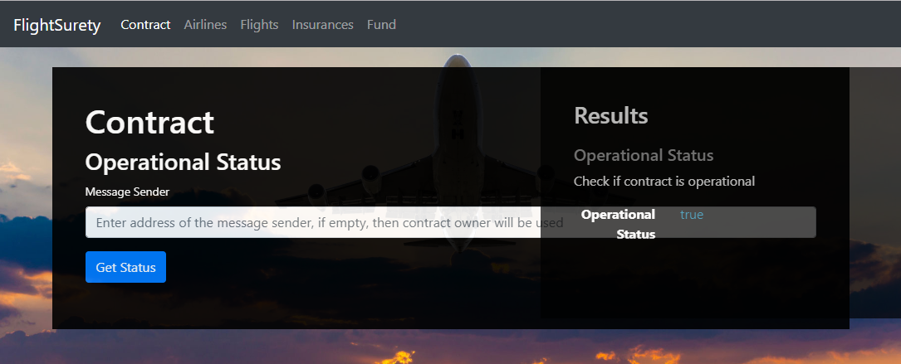
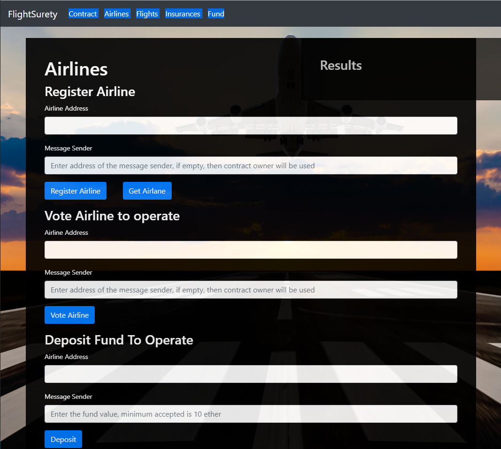
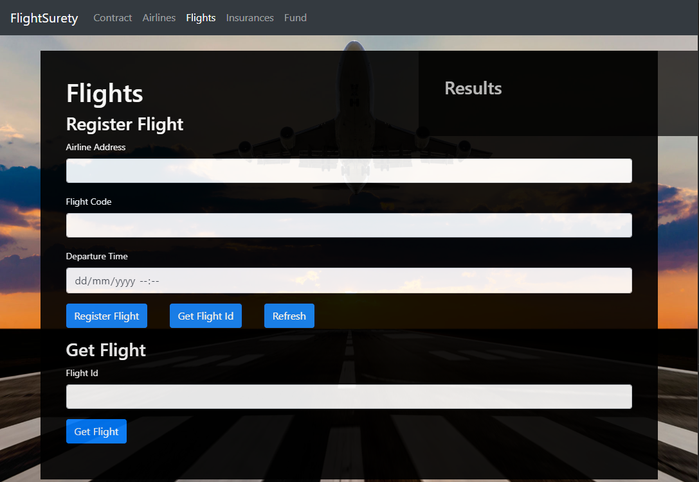
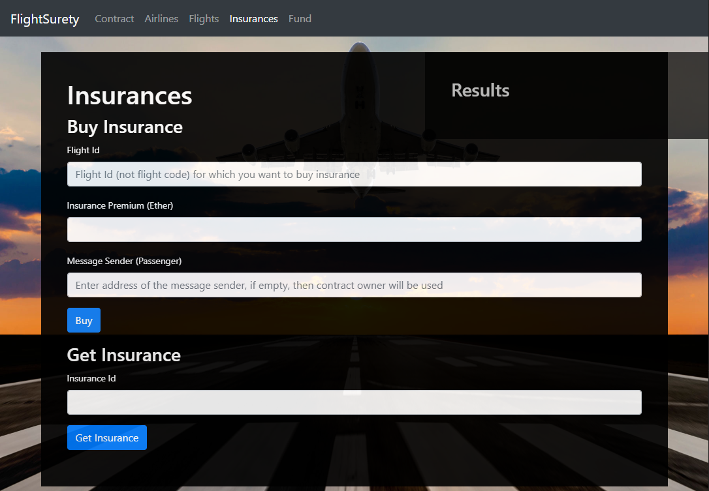
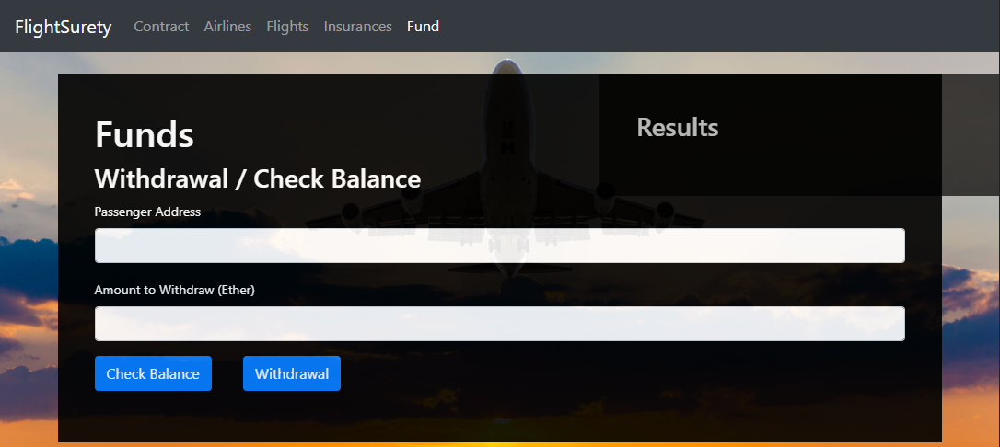

# Flight Surety

## Getting Started

The proposal of this document is to guide you over this project.

### Technical References

First of all you have to install somethings. =D

*  [Truffle](https://www.npmjs.com/package/truffle): v5.0.22 - Development environment, testing framework and asset pipeline for Ethereum
*  [Ganache CLI](https://www.npmjs.com/package/ganache-cli): v6.4.4 - Uses ethereumjs to simulate full client behavior and make developing Ethereum applications faster, easier, and safer
*  [Metamask](https://metamask.io/): v6.7.2 - It allows you to run Ethereum dApps right in your browser without running a full Ethereum node
*  [Solidity](https://solidity.readthedocs.io): >=0.4.24 - Ethereum language for writing Smart Contracts
*  [Node](https://nodejs.org): v12.6.0 - JavaScript runtime
*  [Web3.js](https://web3js.readthedocs.io): v1.0.0-beta.37 - A collection of libraries which allow you to interact with a local or remote Ethereum node, using an HTTP, WebSocket or IPC connection
*  [truffle-hdwallet-provider](https://www.npmjs.com/package/truffle-hdwallet-provider): v1.0.14 - Use it to sign transactions for addresses derived from a 12 or 24 word mnemonic.

### Running Solution

You will nedd three terminals:

 - Terminal 1:
	 -  `ganache-cli -l 999999999999 -m "candy maplcake sugar puddi cream honey rich smooth crumble sweet treat" -e 10000 -a 30`: To start Ganache with specific Wallets
 - Terminal 2 - On the root folder run:
	 - `npm i`: To install all the dependencies
	 - `truffle migrate --network development_cli`: To apply the contrats to the network
	 - `npm run dapp`: To start the web site at *locallhost:8000*
 - Terminal 3 - On the root folder run:
	 - `npm run server`: It will start the Oracles server

### Running Tests

You will need two terminals:

 - Terminal 1:
	 -  `ganache-cli -l 999999999999 -m "candy maplcake sugar puddi cream honey rich smooth crumble sweet treat" -e 10000 -a 30`: To start Ganache with specific Wallets
 - Terminal 2 - On the root folder run:
	 - `truffle migrate --network development_cli`: To apply the contrats to the network
	 - `truffle test --network development_cli`: To test the hole application

### The web site

The text above will give you an idea of how to use the web site.

#### The contract
Used to check if it is all ok and running, note the Results up on the right, this area is used by the others screens to present answers to the user.

#### The Airline
Here you can register, vote and deposit funds to an Airline. If you get any errors they wiil be shown on the results area

#### The Flights
Note you can register and get flight Id here, the flight id will be used to register new insurances.
The refresh button is not working, and should trigger the Oracles, if they work. Sorry about that.

#### The Insurance
Where you can buy new insurances, note that the flight Id will be needed.

#### The Funds
By this screen the user can verify his Fund's Balance and make a withdraw.

